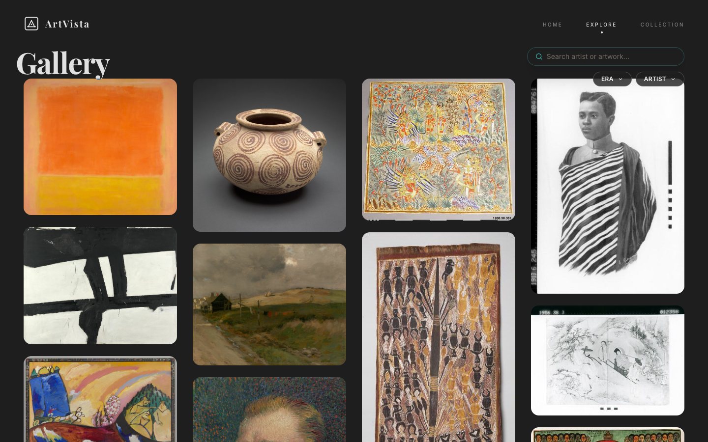

# ArtVista 🎨

**ArtVista** is a modern, responsive digital art gallery that aggregates masterpieces from the **Art Institute of Chicago** and **Europeana**. It features a "Museum Dark" aesthetic, cinematic animations, and a seamless user experience.


## ✨ Key Features

### 🖼️ Dual-API Aggregation
- **Unified Feed**: Seamlessly merges data from two different museum APIs into a consistent format.
- **Robust Error Handling**: "Try Again" mechanisms and skeleton loaders ensure smoothness even during network hiccups.

### 🎥 Cinematic Motion
- **Page Transitions**: Smooth slide and fade effects when navigating between views.
- **Staggered Grid**: Artworks cascade into view for a premium feel.
- **Micro-Interactions**: Satisfying "pop" effects on buttons and tactile hover states.

### 🏛️ Premium UI/UX
- **Curated Collections**: Save your favorite artworks to your local gallery (persisted via LocalStorage).
- **Responsive Design**: Precise layouts for Mobile, Tablet, and Desktop.
- **Dark/Light Mode**: Fully themable interface with carefully tuned contrast variables.

## 🛠️ Technology Stack

- **Core**: React 19, Vite
- **Styling**: Tailwind CSS, PostCSS
- **Animations**: Framer Motion, GSAP
- **Data**: Art Institute of Chicago API, Europeana API
- **Icons**: Lucide React
- **Routing**: React Router v6

## 🚀 Getting Started

Follow these steps to run the project locally on your machine.

### Prerequisites
- Node.js (v18 or higher)
- npm (v9 or higher)

### Installation

1.  **Clone the repository**
    ```bash
    git clone https://github.com/yourusername/artvista.git
    cd artvista
    ```

2.  **Install dependencies**
    ```bash
    npm install
    ```

3.  **Environment Setup**
    Create a `.env` file in the root directory:
    ```bash
    VITE_EUROPEANA_API_KEY=your_key_here
    ```
    *Note: If you don't have a key, the app will use a fallback demo mode automatically.*

4.  **Run the development server**
    ```bash
    npm run dev
    ```
    Open [http://localhost:5173](http://localhost:5173) in your browser.

5.  **Build for Production**
    ```bash
    npm run build
    ```

## 📸 Mockups

To demonstrate the application structure, here are the main views:

### 🏠 Home Page


### 🔍 Explore Grid


## 🤝 Credits

- **Design Inspiration**: Modern museum websites and digital archives.
- **APIs**:
    - [Art Institute of Chicago API](https://api.artic.edu/docs/)
    - [Europeana REST API](https://pro.europeana.eu/page/intro)

